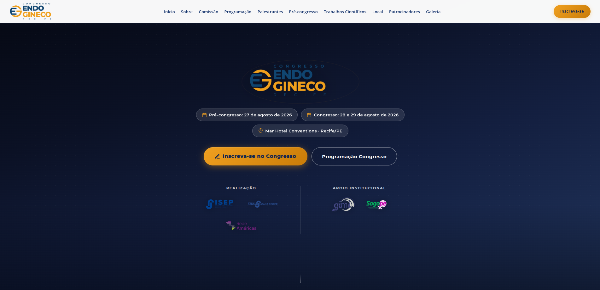

# Congresso Internacional Endogineco 2026

[← Voltar ao portfólio](../README.md)

Site institucional para divulgação do congresso de endometriose e ginecologia minimamente invasiva em Recife/PE.

**Site:** [congressoendoginecorecife.com.br](https://www.congressoendoginecorecife.com.br/)

**Status:** publicado · código-fonte privado

---

## Objetivo

Apresentar o **Congresso Internacional Endogineco 2026** (pré-congresso em 27/08; congresso em 28 e 29/08 no Mar Hotel Conventions, Recife/PE), promovido pelo ISEP — Instituto Santa Joana de Ensino e Pesquisa.

O site comunica a escala do evento (cirurgias ao vivo, palestras, podcasts, submissão de trabalhos), organiza a programação multi-dia e direciona inscrições via Sympla.

## Contexto

Segunda edição de um congresso já consolidado em 2025. Evento real da área médica, produzido pela **Luka Plan Promoções e Eventos**. O código-fonte integra um monorepo privado na Vercel (roteamento por domínio), mas o site permanece **publicado e acessível**.

## O que foi construído

| Seção | Destaques |
|-------|-----------|
| **Hero e navegação** | Destaques do congresso, chips de datas, CTAs de inscrição e programação, menu responsivo |
| **Sobre o evento** | Histórico da edição anterior, novidades de 2026 e contagem regressiva |
| **Comissão organizadora** | Corpo organizador do congresso |
| **Programação científica** | Abas por dia (27, 28 e 29/08); múltiplos auditórios; download de PDF e planilha |
| **Palestrantes** | Carrossel estilo streaming com modais de biografia |
| **Pré-congresso** | Carrossel de cursos (USG, nutrição, oncoginecologia, sutura dry lab) |
| **Trabalhos científicos** | Comissão julgadora e CTA de submissão |
| **Local, patrocinadores e galeria** | Mar Hotel Conventions; galeria da edição 2025 com carregamento via CSV e lightbox |
| **Inscrições e rodapé** | Sympla, contato da Luka Plan e navegação secundária |

**Detalhes técnicos:** HTML/CSS/JavaScript vanilla, carrosséis com arraste e setas, galeria dinâmica (`fetch` + CSV), lightbox, modais, abas de programação, metadados SEO/Open Graph e layout responsivo.

## Stack tecnológica

| Camada | Tecnologias |
|--------|-------------|
| **Front-end** | HTML5, CSS3, JavaScript (vanilla) |
| **Conteúdo dinâmico** | Galeria alimentada por CSV; programação em HTML com abas por dia |
| **Integrações** | Sympla (inscrições) |
| **Deploy** | Vercel · domínio customizado · roteamento por host |

## Screenshots

Prévia legível do topo da página. A captura completa (GoFullPage) mostra o site inteiro — **clique para ampliar**.

| Hero |
|:---:|
|  |

<strong>Visão completa da página</strong> (clique para expandir)

## Autoria e participação

Responsável pelo **desenvolvimento front-end** do site — da estrutura visual à publicação, incluindo carrosséis, galeria dinâmica, programação multi-dia, responsividade e entrega para produção.

Produção do evento: **Luka Plan Promoções e Eventos**.
