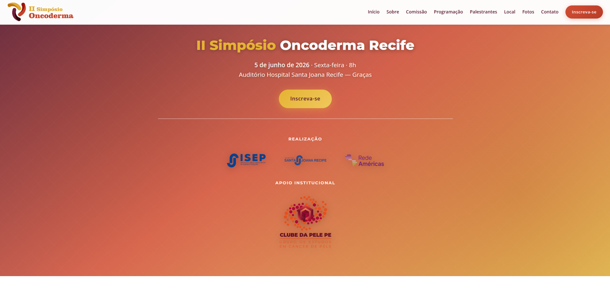

# II Simpósio Oncoderma Recife

[← Voltar ao portfólio](../README.md)

Site institucional para divulgação do simpósio de oncologia cutânea realizado em Recife/PE.

**Site:** [oncodermarecife2026.com.br](https://www.oncodermarecife2026.com.br/)

**Status:** publicado · código-fonte privado

---

## Objetivo

Apresentar o **II Simpósio Oncoderma Recife** (5 de junho de 2026, Auditório Hospital Santa Joana — Graças), promovido pelo Hospital Santa Joana Recife e pelo ISEP, com apoio institucional da Clínica de Pele.

O site centraliza informações do evento, programação científica, palestrantes, local, patrocinadores e canal de inscrição via Sympla — com foco em credibilidade institucional e conversão de inscritos (70 vagas).

## Contexto

Evento real da área médica, produzido pela **Luka Plan Promoções e Eventos**. O código-fonte integra um monorepo privado na Vercel (roteamento por domínio), mas o site permanece **publicado e acessível**.

## O que foi construído

| Seção | Destaques |
|-------|-----------|
| **Hero e navegação** | Chamada principal, menu âncora, CTA de inscrição, layout responsivo com menu mobile |
| **Sobre o evento** | Contexto institucional, realização e apoio |
| **Contagem regressiva** | Timer dinâmico até a data do evento |
| **Comissão organizadora** | Grid de membros da comissão |
| **Programação científica** | Tabela responsiva com 7 mesas temáticas; download de PDF |
| **Palestrantes** | Cards com modais de biografia |
| **Local** | Endereço e orientação de acesso |
| **Inscrições** | Integração com Sympla |
| **Patrocinadores, galeria e contato** | Apoios, aviso de fotos pós-evento e dados da organização |

**Detalhes técnicos:** HTML/CSS/JavaScript vanilla, metadados SEO e Open Graph, animações de entrada (`IntersectionObserver`), modais acessíveis e tipografia/cores alinhadas à identidade do evento.

## Stack tecnológica

| Camada | Tecnologias |
|--------|-------------|
| **Front-end** | HTML5, CSS3, JavaScript (vanilla) |
| **Conteúdo** | Programação em HTML; PDF de programação para download |
| **Integrações** | Sympla (inscrições) |
| **Deploy** | Vercel · domínio customizado · roteamento por host |

## Screenshots

Prévia legível do topo da página. A captura completa (GoFullPage) mostra o site inteiro — **clique para ampliar**.

| Hero |
|:---:|
|  |

<strong>Visão completa da página</strong> (clique para expandir)

## Autoria e participação

Responsável pelo **desenvolvimento front-end** do site — da estrutura visual à publicação, incluindo adaptação de layout, responsividade, programação, modais de palestrantes e entrega para produção.

Produção do evento: **Luka Plan Promoções e Eventos**.
