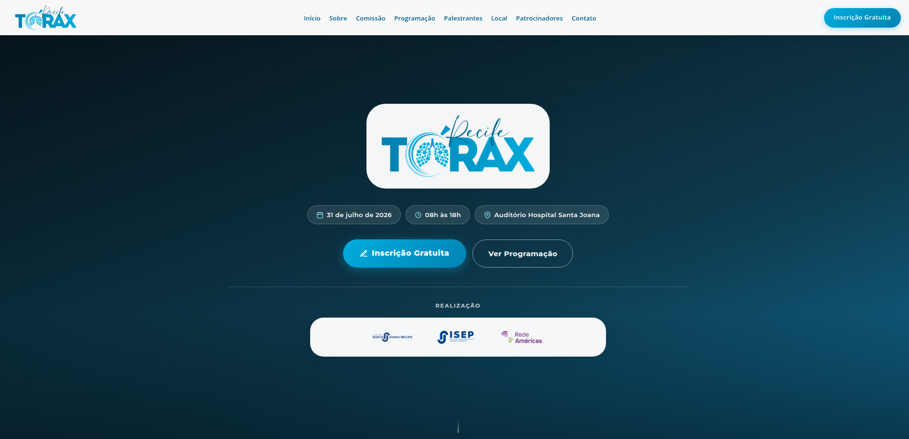

# Recife Tórax 2026

[← Voltar ao portfólio](../README.md)

Site institucional para divulgação do evento de oncologia torácica em Recife/PE.

**Site:** [recifetorax2026.com.br](https://www.recifetorax2026.com.br/)

**Status:** publicado · em atualização contínua até o evento · código-fonte privado

---

## Objetivo

Apresentar o **Recife Tórax 2026** (31 de julho de 2026, das 8h às 18h, Auditório do Hospital Santa Joana), promovido pelo Hospital Santa Joana Recife, pelo ISEP e pela Rede Américas.

O site concentra data, horário e local do evento, organiza a programação de um dia único e direciona inscrições gratuitas via Sympla.

## Contexto

Evento real da área médica, produzido pela **Luka Plan Promoções e Eventos**. É o site mais recente entre os projetos entregues ao cliente, ainda em fase de atualização (comissão, palestrantes e patrocinadores sendo confirmados). O código-fonte integra o mesmo monorepo privado na Vercel dos demais eventos, mas o site permanece **publicado e acessível**.

## O que foi construído

| Seção | Destaques |
|-------|-----------|
| **Hero e navegação** | Identidade visual do evento, chips de data/horário/local, CTAs de inscrição e programação |
| **Sobre o evento** | Contexto institucional e realização |
| **Comissão organizadora** | Corpo organizador do evento |
| **Programação científica** | Programação de dia único; download de PDF |
| **Palestrantes** | Cards com modais de biografia |
| **Local** | Endereço e orientação de acesso |
| **Patrocinadores** | Apoiadores do evento |
| **Inscrições e contato** | Integração com Sympla e dados da organização |

**Detalhes técnicos:** HTML/CSS/JavaScript vanilla, animações de entrada (`IntersectionObserver`), modais acessíveis e metadados SEO/Open Graph. Site em **português (PT)**, sem seletor de idioma — diferente dos demais eventos do cliente, que são multilíngues.

## Stack tecnológica

| Camada | Tecnologias |
|--------|-------------|
| **Front-end** | HTML5, CSS3, JavaScript (vanilla) |
| **Conteúdo** | Programação em HTML; PDF de programação para download |
| **Integrações** | Sympla (inscrições) |
| **Deploy** | Vercel · domínio customizado · roteamento por host |

## Screenshots

Prévia legível do topo da página. A captura completa mostra o site inteiro — **clique para ampliar**.

| Hero |
|:---:|
|  |

<strong>Visão completa da página</strong> (clique para expandir)

## Autoria e participação

Responsável pelo **desenvolvimento front-end** do site — da estrutura visual à publicação, incluindo responsividade, programação, modais de palestrantes e entrega para produção.

Produção do evento: **Luka Plan Promoções e Eventos**.
