# RGPay

[← Voltar ao portfólio](../README.md)

Sistema full stack de PDV e gestão comercial para bares, restaurantes e casas de show.

**Demo (login):** [https://rgpay.vercel.app/](https://rgpay.vercel.app/)

**Status:** descontinuado antes da finalização · código-fonte privado · desenvolvido em equipe (3 devs)

---

## Objetivo

O RGPay foi concebido para simplificar vendas, controle comercial e integração com terminais de pagamento em ambientes de alto fluxo. A plataforma centraliza cardápio, pedidos, multi-unidades e relatórios operacionais em um painel web.

A visão original priorizava estabelecimentos com terminais **Cielo Lio**: sincronizar o catálogo de produtos com as maquininhas, registrar pedidos no ponto de venda e administrar tudo por um painel no escopo de suites comerciais de PDV — multi-unidades, eventos, relatórios e controle de acesso por perfil faziam parte do roadmap.

## Sobre o projeto

O projeto foi desenvolvido de forma independente, fora de qualquer vínculo empregatício, e interrompido antes da conclusão. Permanece como **case de portfólio** para demonstrar trabalho real em arquitetura, interface, regras de negócio e integração front-end/back-end.

## Problema que resolve

Bares, restaurantes e casas de show costumam depender de ferramentas fragmentadas — planilhas, cardápios isolados nas maquininhas e conciliação manual —, especialmente ao operar várias unidades ou eventos temáticos. O RGPay endereça esse cenário com:

- **Back-office web unificado** para produtos, categorias, pedidos, unidades e eventos
- **Visibilidade operacional** via dashboard e relatórios exportáveis (CSV/PDF)
- **Base para integração com terminais** de cartão (protótipo Cielo Lio em React Native)
- **Alternância de contexto multi-unidade** para um mesmo login administrar filiais distintas

## O que foi construído

Protótipo administrativo funcional, com rotas autenticadas e fluxos de CRUD nos principais domínios:

| Área | Destaques |
|------|-----------|
| **Dashboard** | KPIs, gráficos de faturamento por hora, filtros por data e evento |
| **Catálogo** | Produtos e categorias com escopo por unidade |
| **Pedidos** | Listagem e tela de detalhes |
| **Unidades e eventos** | Cadastro multi-filial e agendamento de eventos |
| **Maquininhas** | Registro de terminais por unidade |
| **Relatórios** | Faturamento por grupo de produto, filtros por data/evento, exportação CSV e PDF |
| **Conta** | Perfil do usuário e personalização de tema (claro/escuro e presets de cor) |

Um **protótipo em React Native** explorou fluxos de pagamento Cielo Lio; a sincronização ponta a ponta com o terminal não foi concluída antes do encerramento do projeto.

## Escopo previsto (não entregue)

- Integração completa com a **API Cielo Lio** (sync de catálogo, checkout no dispositivo, impressão de tickets)
- **Grupos de acesso** por perfil (leitura / escrita / admin)
- Refinamento **PWA / mobile** para operação em campo (estrutura de service worker iniciada)
- Hardening de produção em todos os ambientes de deploy

## Stack tecnológica

| Camada | Tecnologias |
|--------|-------------|
| **Linguagem** | TypeScript |
| **Front-end** | React 19, Vite, React Router, Material UI, Redux Toolkit, Formik + Yup, ECharts, Axios, Tailwind CSS |
| **Back-end** | Node.js, NestJS, Sequelize, Passport JWT, Swagger |
| **Banco de dados** | PostgreSQL |
| **Integrações** | Cielo Lio (protótipo React Native) |
| **Deploy** | Front-end na Vercel · API no Azure App Service · CI/CD com GitHub Actions |

O acesso público à demo fica **limitado à tela de login** — os demais módulos exigem autenticação. As **screenshots** abaixo complementam a visualização do painel administrativo. A **API NestJS** chegou a ser implantada no **Azure App Service** via pipeline automatizado.

## Screenshots

Interface em tema escuro — da tela de login ao painel administrativo, com navegação lateral, seletor de unidade e layouts orientados a analytics.

| Login | Dashboard — KPIs e gráficos por hora |
|:---:|:---:|
| 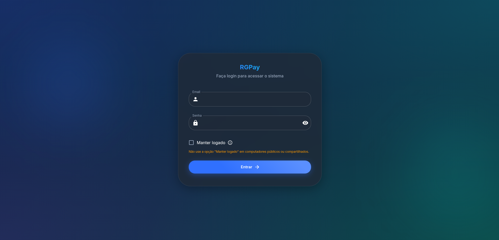 | 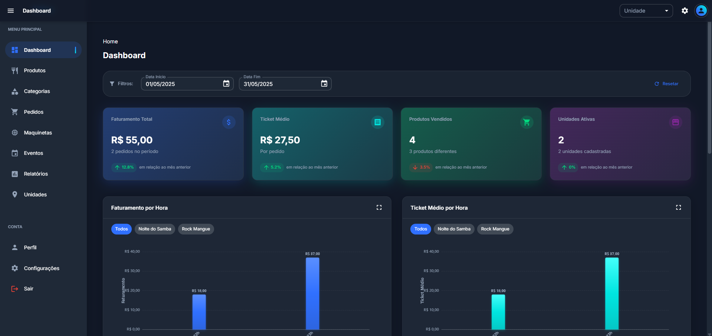 |

| Dashboard — produtos e formas de pagamento | Produtos |
|:---:|:---:|
| 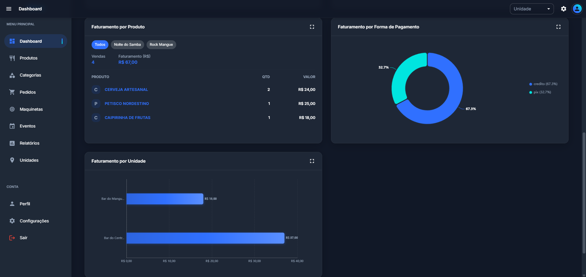 | 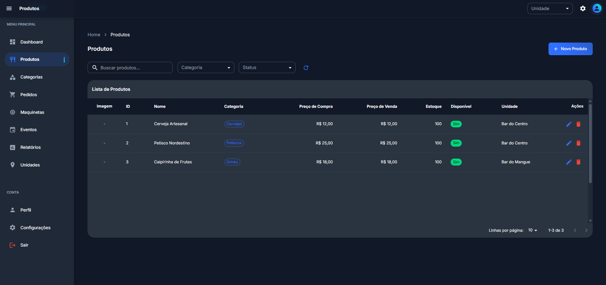 |

| Categorias | Pedidos |
|:---:|:---:|
| 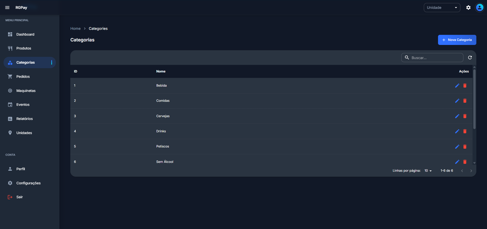 | 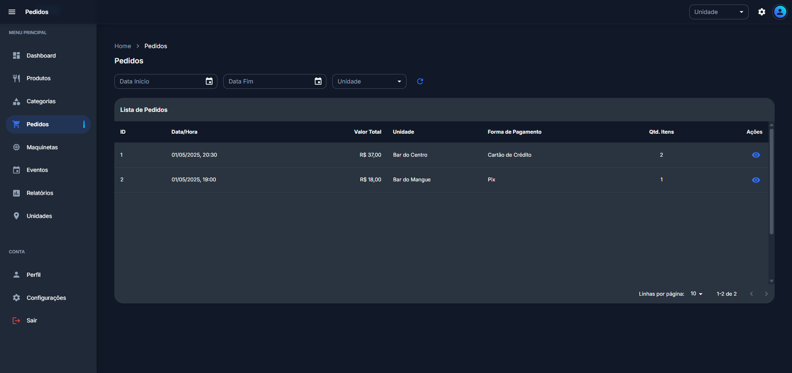 |

| Maquininhas | Eventos |
|:---:|:---:|
| 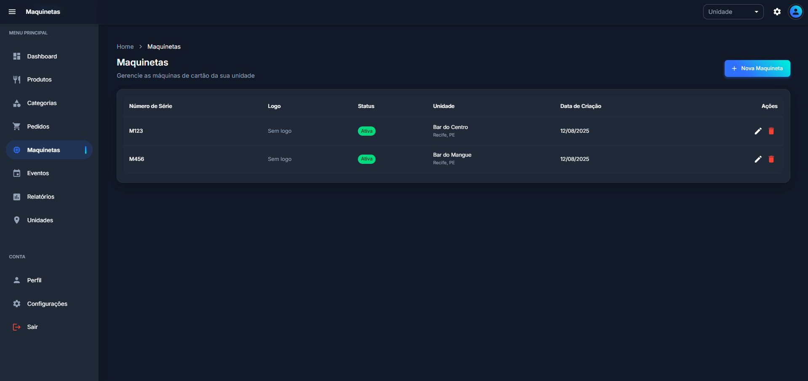 | 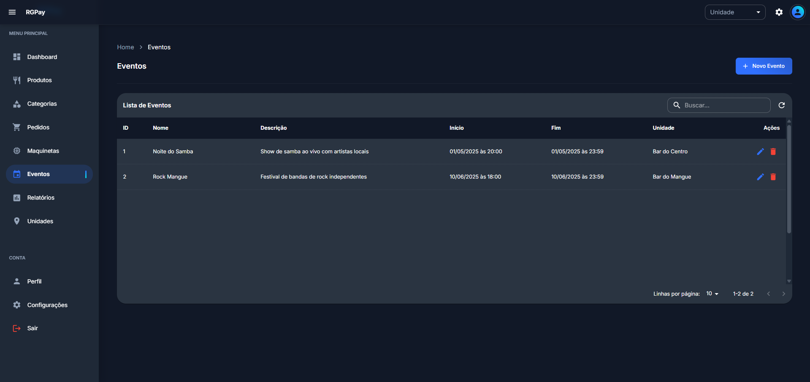 |

| Relatórios (exportação CSV / PDF) | Multi-unidades |
|:---:|:---:|
| 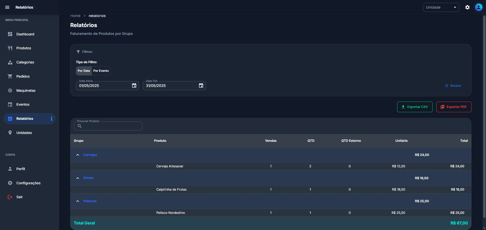 | 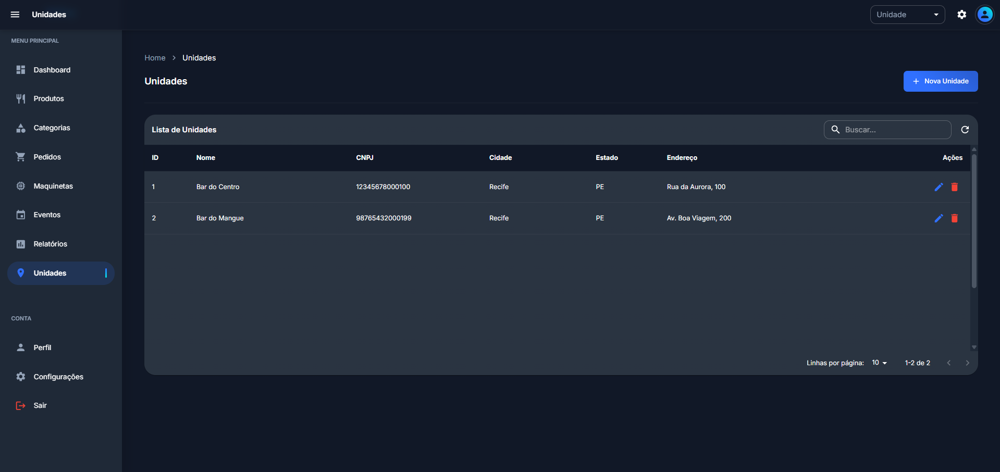 |

| Perfil do usuário | Tema e configurações |
|:---:|:---:|
| 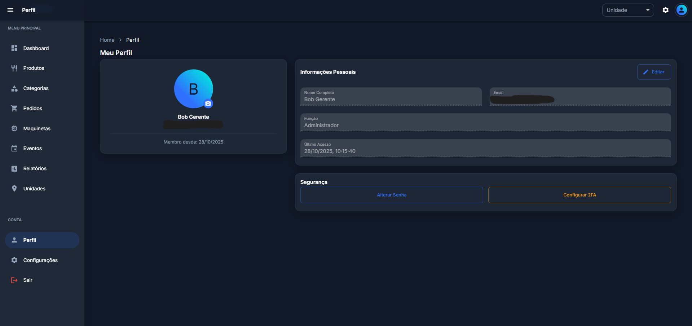 | 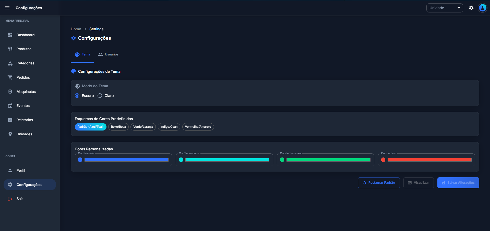 |

## Autoria e participação

Autoria compartilhada entre **três desenvolvedores**, em colaboração independente. As contribuições abrangeram interface front-end, APIs back-end, modelagem de dados e pesquisa de integração com terminais de pagamento.

Participei do desenvolvimento **em equipe**, com atuação em front-end e back-end conforme as demandas de cada módulo do sistema.
