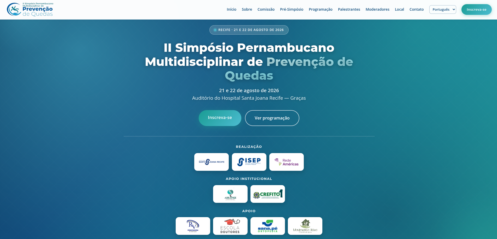

# II Simpósio Pernambucano Multidisciplinar de Prevenção de Quedas

[← Voltar ao portfólio](../README.md)

Site institucional para divulgação do simpósio multidisciplinar de prevenção de quedas em pessoas idosas, em Recife/PE.

**Site:** [spmpq.com.br](https://www.spmpq.com.br/)

**Status:** publicado · em atualização contínua até o evento · código-fonte privado

---

## Objetivo

Apresentar o **II Simpósio Pernambucano Multidisciplinar de Prevenção de Quedas** (21 e 22 de agosto de 2026, Auditório do Hospital Santa Joana — Graças), promovido pelo Hospital Santa Joana Recife, pelo ISEP e pela Rede Américas, com apoio institucional da ABRAFIGE e do CREFITO-1.

O site comunica o caráter multidisciplinar do evento (medicina, fisioterapia, enfermagem, nutrição, fonoaudiologia, terapia ocupacional, farmácia e áreas psicossociais), organiza a programação de dois dias — incluindo um pré-simpósio com oficinas práticas — e direciona inscrições via Sympla.

## Contexto

Evento real da área médica, produzido pela **Luka Plan Promoções e Eventos**. O código-fonte integra um monorepo privado na Vercel (roteamento por domínio), mas o site permanece **publicado e acessível**, com conteúdo atualizado periodicamente conforme a confirmação de palestrantes, moderadores e programação.

## O que foi construído

| Seção | Destaques |
|-------|-----------|
| **Hero e navegação** | Chamada principal, seletor de idioma, menu responsivo com âncoras, CTAs de inscrição e programação |
| **Sobre o evento** | Contexto institucional, realização, apoio institucional e apoiadores |
| **Contagem regressiva** | Timer dinâmico até a data do evento |
| **Comissão organizadora** | Grid de coordenação científica e organizadores |
| **Pré-simpósio** | Seção dedicada às oficinas práticas de abertura (21/08) |
| **Programação científica** | Tabela responsiva por dia; download de PDF |
| **Palestrantes e moderadores** | Cards com modais de biografia, separados por papel no evento |
| **Local** | Endereço e orientação de acesso |
| **Inscrições e contato** | Integração com Sympla e dados da organização |

**Detalhes técnicos:** HTML/CSS/JavaScript vanilla, **internacionalização client-side (PT/EN/ES)** via atributos `data-i18n`, animações de entrada (`IntersectionObserver`), modais acessíveis, contagem regressiva dinâmica e metadados SEO/Open Graph.

## Stack tecnológica

| Camada | Tecnologias |
|--------|-------------|
| **Front-end** | HTML5, CSS3, JavaScript (vanilla) |
| **Internacionalização** | Dicionário de traduções PT/EN/ES aplicado via `data-i18n` |
| **Conteúdo** | Programação em HTML; PDF de programação para download |
| **Integrações** | Sympla (inscrições) |
| **Deploy** | Vercel · domínio customizado · roteamento por host |

## Screenshots

Prévia legível do topo da página. A captura completa mostra o site inteiro — **clique para ampliar**.

| Hero |
|:---:|
|  |

<strong>Visão completa da página</strong> (clique para expandir)

## Autoria e participação

Responsável pelo **desenvolvimento front-end** do site — da estrutura visual à publicação, incluindo internacionalização, responsividade, programação por dia, modais de palestrantes/moderadores e entrega para produção.

Produção do evento: **Luka Plan Promoções e Eventos**.
